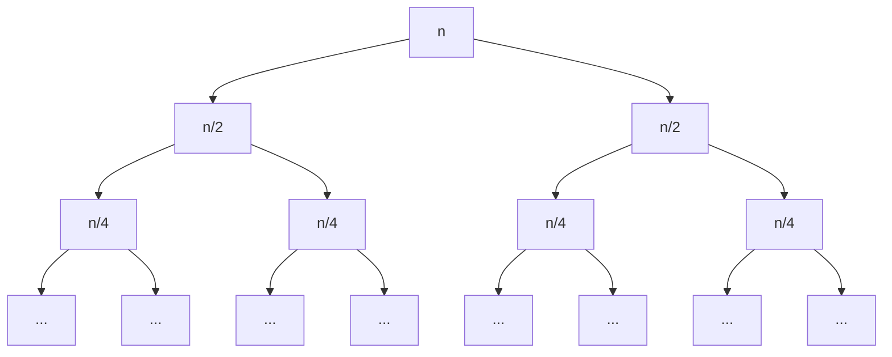
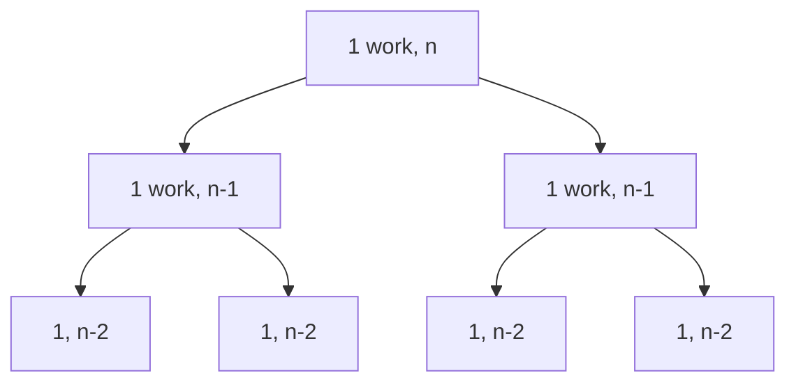
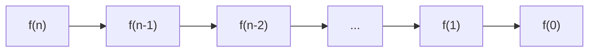
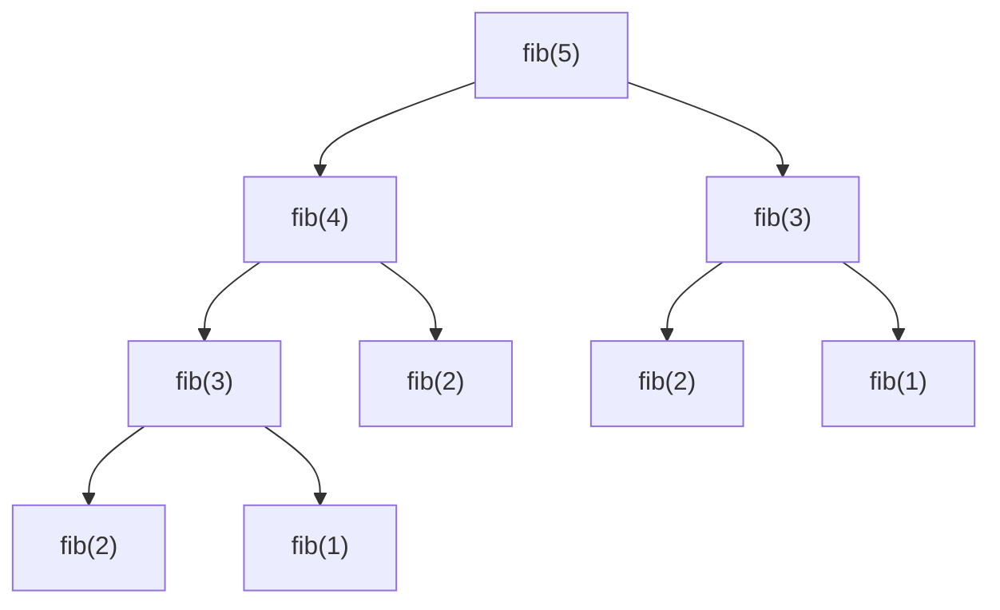
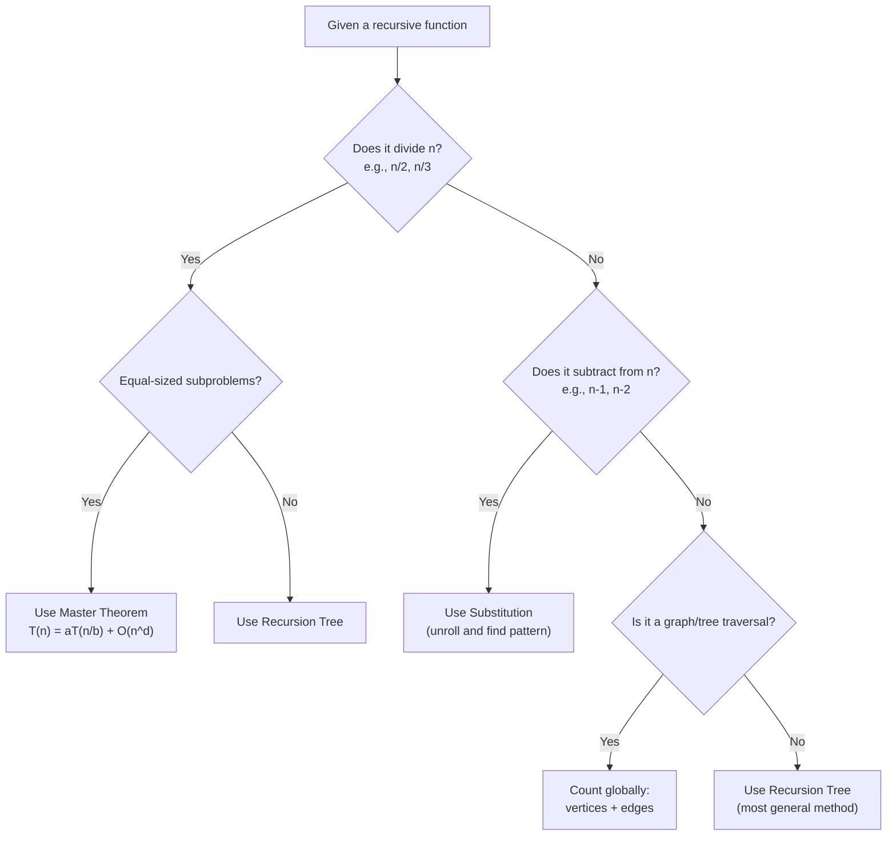

# 🧮 Time Complexity Analysis — A Complete Tutorial

> **Focus:** Recursive functions (but covers iterative too)  
> **Goal:** Go from "I don't know where to start" to "I can analyze any function"

---

## Table of Contents

- [Part 1: Foundations](#part-1-foundations)
  - [What is Time Complexity?](#what-is-time-complexity)
  - [Counting Atomic Operations](#counting-atomic-operations)
  - [Big O, Ω, Θ — What They Mean](#big-o-ω-θ--what-they-mean)
  - [Common Complexity Classes](#common-complexity-classes)
- [Part 2: Iterative Analysis](#part-2-iterative-analysis)
  - [Single Loops](#single-loops)
  - [Nested Loops](#nested-loops)
  - [Non-Obvious Loops](#non-obvious-loops)
- [Part 3: Recursive Analysis — The Core](#part-3-recursive-analysis--the-core)
  - [The 3-Step Method](#the-3-step-method)
  - [Method 1: Substitution (Unrolling)](#method-1-substitution-unrolling)
  - [Method 2: Recursion Tree](#method-2-recursion-tree)
  - [Method 3: Master Theorem](#method-3-master-theorem)
- [Part 4: Patterns You Must Memorize](#part-4-patterns-you-must-memorize)
  - [Linear Recursion](#pattern-1-linear-recursion)
  - [Divide and Conquer](#pattern-2-divide-and-conquer)
  - [Tree Recursion (Branching)](#pattern-3-tree-recursion-branching)
  - [Recursion with a Loop](#pattern-4-recursion-with-a-loop)
  - [Graph/Tree Traversal](#pattern-5-graphtree-traversal)
- [Part 5: Practice Problems (with Full Solutions)](#part-5-practice-problems)
- [Part 6: Resources](#part-6-resources)

---

## Part 1: Foundations

### What is Time Complexity?

Time complexity counts **how many elementary operations** an algorithm performs as a function of input size `n`.

Elementary (atomic) operations — each costs **1 unit**:
- Arithmetic: `+`, `-`, `*`, `/`, `%`
- Comparison: `<`, `>`, `==`, `!=`
- Assignment: `x = 5`
- Array access: `arr[i]`
- Function call overhead (the call itself, not the body)
- Return statement

### Counting Atomic Operations

```python
def example(n):
    x = 0            # 1 assignment
    for i in range(n):   # n iterations
        x = x + i        # 1 add + 1 assign = 2 ops per iteration
    return x             # 1 return
```

Total: `1 + n × 2 + 1 = 2n + 2`

We keep all constants for now. Later we drop them with Big O.

### Big O, Ω, Θ — What They Mean

| Notation | Meaning | Analogy |
|----------|---------|---------|
| **O(f(n))** | Upper bound (at most) | `≤` |
| **Ω(f(n))** | Lower bound (at least) | `≥` |
| **Θ(f(n))** | Tight bound (exactly) | `=` |

`2n + 2` → the dominant term is `n` → **Θ(n)**

**Rules for simplification:**
1. Drop constants: `5n` → `n`
2. Drop lower-order terms: `n² + 3n + 7` → `n²`
3. Multiplication stays: `n × log n` stays as `n log n`
4. Addition = take the max: `O(n) + O(n²)` = `O(n²)`
5. Nesting = multiply: an `O(n)` loop inside an `O(n)` loop = `O(n²)`

### Common Complexity Classes

```
O(1) < O(log n) < O(n) < O(n log n) < O(n²) < O(n³) < O(2ⁿ) < O(n!)
```

| Complexity | n=10 | n=100 | n=1000 |
|-----------|------|-------|--------|
| O(1) | 1 | 1 | 1 |
| O(log n) | 3 | 7 | 10 |
| O(n) | 10 | 100 | 1000 |
| O(n log n) | 33 | 664 | 9966 |
| O(n²) | 100 | 10,000 | 1,000,000 |
| O(2ⁿ) | 1024 | 1.26 × 10³⁰ | ☠️ |

---

## Part 2: Iterative Analysis

### Single Loops

```python
# Pattern: i goes from 0 to n-1
for i in range(n):      # n iterations
    print(i)             # 1 op
# Total: n × 1 = n
```

```python
# Pattern: i doubles each time
i = 1
while i < n:             # how many times?
    print(i)             # 1 op
    i = i * 2            # i goes: 1, 2, 4, 8, ... 2^k
# Stops when 2^k ≥ n → k = log₂(n)
# Total: log₂(n)
```

```python
# Pattern: i halves each time
i = n
while i > 1:
    print(i)
    i = i // 2           # n, n/2, n/4, ... 1
# Total: log₂(n)
```

### Nested Loops

```python
for i in range(n):          # n times
    for j in range(n):      #   n times each
        print(i, j)         #     1 op
# Total: n × n × 1 = n²
```

```python
# TRICKY: dependent inner loop
for i in range(n):          # i = 0, 1, 2, ..., n-1
    for j in range(i):      # j runs 0, 1, 2, ..., i-1 times
        print(i, j)
# Total: 0 + 1 + 2 + ... + (n-1) = n(n-1)/2 = (n² - n) / 2
# With constants: (1/2)n² - (1/2)n
# Big O: O(n²)
```

### Non-Obvious Loops

```python
# Log inside linear
for i in range(n):          # n times
    j = i
    while j > 0:            #   log(i) times
        j = j // 2
# Total: log(1) + log(2) + ... + log(n) = log(n!) ≈ n log n
```

```python
# Square root loop
i = 0
while i * i < n:
    i += 1
# Stops when i² ≥ n → i = √n
# Total: √n
```

---

## Part 3: Recursive Analysis — The Core

This is where most people get stuck. Here's the systematic approach.

### The 3-Step Method

For **any** recursive function:

```
Step 1: Write the recurrence relation    T(n) = ...T(...) + ...
Step 2: Find the base case               T(1) = ... or T(0) = ...
Step 3: Solve the recurrence             (using substitution, tree, or master theorem)
```

**How to write the recurrence (Step 1):**

Look at the function and ask:
1. How many recursive calls? → that's the coefficient of T
2. What argument is passed? → that goes inside T(...)
3. What other work is done? → that's added outside T

```python
def f(n):
    if n <= 1:             # base case: T(1) = 1
        return 1
    return f(n - 1) + n    # ONE call to f(n-1), PLUS n work? No — just 1 addition
```

The `+ n` in `return f(n-1) + n` is **not** n work. It's 1 addition operation. The `n` is a **value**, not work.

> ⚠️ **Critical distinction:** work done = lines of code executed at this level, NOT the values being computed.

So:
```
T(n) = T(n - 1) + 1      ← one recursive call + constant work
T(1) = 1
```

### Method 1: Substitution (Unrolling)

**Idea:** Expand the recurrence repeatedly until you see a pattern.

**Example:** `T(n) = T(n-1) + 1, T(1) = 1`

```
T(n) = T(n-1) + 1
     = [T(n-2) + 1] + 1          = T(n-2) + 2
     = [T(n-3) + 1] + 2          = T(n-3) + 3
     ...
     = T(n-k) + k                ← pattern after k steps
```

Hits base case when `n - k = 1` → `k = n - 1`:

```
T(n) = T(1) + (n - 1) = 1 + n - 1 = n
```

**Answer: Θ(n)**

**Example 2:** `T(n) = T(n-1) + n, T(1) = 1`

```
T(n) = T(n-1) + n
     = T(n-2) + (n-1) + n
     = T(n-3) + (n-2) + (n-1) + n
     ...
     = T(1) + 2 + 3 + ... + n
     = 1 + 2 + 3 + ... + n
     = n(n+1)/2
```

**Answer: Θ(n²)**

**Example 3:** `T(n) = T(n/2) + 1, T(1) = 1`

```
T(n) = T(n/2) + 1
     = T(n/4) + 1 + 1            = T(n/4) + 2
     = T(n/8) + 3
     ...
     = T(n/2^k) + k
```

Hits base case when `n/2^k = 1` → `k = log₂(n)`:

```
T(n) = 1 + log₂(n)
```

**Answer: Θ(log n)**

### Method 2: Recursion Tree

Draw the tree of recursive calls. At each node, write the **non-recursive work** done.

**Example:** `T(n) = 2T(n/2) + n` (merge sort)



| Level | # Nodes | Work per node | Total work at level |
|-------|---------|---------------|---------------------|
| 0 | 1 | n | n |
| 1 | 2 | n/2 | n |
| 2 | 4 | n/4 | n |
| ... | ... | ... | n |
| k | 2^k | n/2^k | n |

**Number of levels:** tree stops when `n/2^k = 1` → `k = log₂(n)`

**Total work:** `n × log₂(n)` = **Θ(n log n)**

---

**Example:** `T(n) = 2T(n-1) + 1` (exponential)



| Level | # Nodes | Work per node | Total |
|-------|---------|---------------|-------|
| 0 | 1 | 1 | 1 |
| 1 | 2 | 1 | 2 |
| 2 | 4 | 1 | 4 |
| k | 2^k | 1 | 2^k |

**Number of levels:** `n` (decreases by 1 each time)

**Total:** `1 + 2 + 4 + ... + 2^(n-1)` = `2^n - 1` = **Θ(2ⁿ)**

### Method 3: Master Theorem

The Master Theorem is a **formula** for recurrences of the form:

```
T(n) = a · T(n/b) + O(n^d)
```

Where:
- `a` = number of recursive calls
- `b` = factor by which input shrinks
- `d` = exponent of work done outside recursion

**The three cases:**

```
Compare log_b(a) vs d:

Case 1:  log_b(a) > d   →   T(n) = Θ(n^(log_b(a)))       "recursion dominates"
Case 2:  log_b(a) = d   →   T(n) = Θ(n^d × log n)         "balanced"
Case 3:  log_b(a) < d   →   T(n) = Θ(n^d)                 "work dominates"
```

**Quick reference table:**

| Recurrence | a | b | d | log_b(a) vs d | Result |
|-----------|---|---|---|----------------|--------|
| T(n) = T(n/2) + 1 | 1 | 2 | 0 | 0 = 0 → Case 2 | Θ(log n) |
| T(n) = 2T(n/2) + n | 2 | 2 | 1 | 1 = 1 → Case 2 | Θ(n log n) |
| T(n) = 2T(n/2) + 1 | 2 | 2 | 0 | 1 > 0 → Case 1 | Θ(n) |
| T(n) = 4T(n/2) + n | 4 | 2 | 1 | 2 > 1 → Case 1 | Θ(n²) |
| T(n) = 2T(n/2) + n² | 2 | 2 | 2 | 1 < 2 → Case 3 | Θ(n²) |
| T(n) = 3T(n/3) + n | 3 | 3 | 1 | 1 = 1 → Case 2 | Θ(n log n) |
| T(n) = T(n/3) + 1 | 1 | 3 | 0 | 0 = 0 → Case 2 | Θ(log n) |

> ⚠️ **Master Theorem does NOT work for:**
> - `T(n) = T(n-1) + ...` (subtracting, not dividing) → use substitution
> - `T(n) = T(n/2) + T(n/3) + ...` (unequal splits) → use Akra-Bazzi or recursion tree
> - `T(n) = 2T(n/2) + n log n` (extra log factor) → use extended master theorem

---

## Part 4: Patterns You Must Memorize

### Pattern 1: Linear Recursion

```python
def f(n):
    if n <= 0: return
    # O(1) work
    f(n - 1)
```

```
T(n) = T(n-1) + 1 → Θ(n)
```

Think of it as a chain of n calls, each doing constant work.



### Pattern 2: Divide and Conquer

```python
def f(n):
    if n <= 1: return
    # O(n) work (e.g., merge step)
    f(n // 2)
    f(n // 2)
```

```
T(n) = 2T(n/2) + n → Θ(n log n)     # merge sort
```

### Pattern 3: Tree Recursion (Branching)

```python
def fib(n):
    if n <= 1: return n
    return fib(n-1) + fib(n-2)
```

```
T(n) = T(n-1) + T(n-2) + 1
```

This is harder. Bound it:

```
T(n) > 2T(n-2)      → T(n) = Ω(2^(n/2))
T(n) < 2T(n-1)      → T(n) = O(2^n)
```

Exact: **Θ(φⁿ)** where φ = (1+√5)/2 ≈ 1.618 (golden ratio)



Each level roughly doubles the nodes → exponential.

### Pattern 4: Recursion with a Loop

```python
def f(n):
    if n <= 1: return
    for i in range(n):    # O(n) work
        print(i)
    f(n - 1)              # ONE recursive call
```

```
T(n) = T(n-1) + n
     = n + (n-1) + (n-2) + ... + 1
     = n(n+1)/2
     → Θ(n²)
```

```python
def g(n):
    if n <= 1: return
    for i in range(n):    # O(n) work
        print(i)
    g(n - 1)
    g(n - 1)              # TWO recursive calls
```

```
T(n) = 2T(n-1) + n
```

This is trickier. Substitution:

```
T(n) = 2T(n-1) + n
     = 2[2T(n-2) + (n-1)] + n         = 4T(n-2) + 2(n-1) + n
     = 4[2T(n-3) + (n-2)] + 2(n-1) + n = 8T(n-3) + 4(n-2) + 2(n-1) + n
     ...
     = 2^k · T(n-k) + Σ 2^i · (n-i) for i=0..k-1
```

At `k = n-1`: dominated by `2^(n-1)` → **Θ(2ⁿ)**

### Pattern 5: Graph/Tree Traversal

```python
def dfs(node, visited, graph):
    visited[node] = True          # 1 op, runs V times across ALL calls
    for neighbor in graph[node]:  # degree(node) iterations
        if not visited[neighbor]: # 1 check per edge
            dfs(neighbor, visited, graph)
```

This is **NOT** a standard recurrence. Instead, count globally:
- Each vertex visited once → V operations
- Each edge checked once (directed) or twice (undirected) → E or 2E
- Total: **V + E** (directed) or **V + 2E** (undirected) → **Θ(V + E)**

> **Key insight:** For graph/tree traversals, don't try to write `T(n) = ...`. Instead, count total work across all calls by asking "how many times is each vertex/edge touched?"

---

## Part 5: Practice Problems

### Problem 1

```python
def mystery(n):
    if n <= 1: return 1
    return mystery(n // 3) + mystery(n // 3) + mystery(n // 3)
```

<details>
<summary>Solution</summary>

**Step 1 — Recurrence:** 3 calls, each with `n/3`, no extra work → `T(n) = 3T(n/3) + 1`

**Step 2 — Master Theorem:** a=3, b=3, d=0  
`log_3(3) = 1 > 0` → Case 1 → **Θ(n¹) = Θ(n)**

</details>

---

### Problem 2

```python
def solve(n):
    if n <= 1: return
    for i in range(n):
        print(i)
    solve(n // 2)
```

<details>
<summary>Solution</summary>

**Recurrence:** `T(n) = T(n/2) + n`

**Master Theorem:** a=1, b=2, d=1  
`log_2(1) = 0 < 1` → Case 3 → **Θ(n)**

**Verify with substitution:**
```
T(n) = n + n/2 + n/4 + ... + 1 = n(1 + 1/2 + 1/4 + ...) ≈ 2n → Θ(n)
```

</details>

---

### Problem 3

```python
def what(n):
    if n <= 1: return
    what(n - 1)
    what(n - 1)
```

<details>
<summary>Solution</summary>

**Recurrence:** `T(n) = 2T(n-1) + 1`

Can't use Master Theorem (subtraction, not division). Substitution:

```
T(n) = 2T(n-1) + 1
     = 2[2T(n-2) + 1] + 1 = 4T(n-2) + 3
     = 8T(n-3) + 7
     = 2^k · T(n-k) + (2^k - 1)
```

At `k = n-1`: `T(n) = 2^(n-1) · T(1) + 2^(n-1) - 1 = 2^n - 1`

**Answer: Θ(2ⁿ)**

</details>

---

### Problem 4

```python
def tricky(arr, lo, hi):
    if lo >= hi: return
    mid = (lo + hi) // 2
    tricky(arr, lo, mid)
    tricky(arr, mid + 1, hi)
    for i in range(lo, hi + 1):     # O(n) work
        print(arr[i])
```

<details>
<summary>Solution</summary>

This is merge sort's structure. Let `n = hi - lo + 1`:

`T(n) = 2T(n/2) + n`

Master Theorem: a=2, b=2, d=1 → `log_2(2) = 1 = 1` → Case 2 → **Θ(n log n)**

</details>

---

### Problem 5

```python
def power(x, n):
    if n == 0: return 1
    if n % 2 == 0:
        half = power(x, n // 2)
        return half * half
    else:
        return x * power(x, n - 1)
```

<details>
<summary>Solution</summary>

When `n` is even: `T(n) = T(n/2) + 1`  
When `n` is odd: `T(n) = T(n-1) + 1`, but `n-1` is then even.

So two consecutive calls at most: `T(n) → T(n-1) → T((n-1)/2)`.
Effectively halving every 2 steps → **Θ(log n)**

</details>

---

### Problem 6

```python
def permutations(arr, l, r):
    if l == r:
        print(arr)
        return
    for i in range(l, r + 1):
        arr[l], arr[i] = arr[i], arr[l]
        permutations(arr, l + 1, r)
        arr[l], arr[i] = arr[i], arr[l]
```

<details>
<summary>Solution</summary>

At level `l`, the loop runs `n - l` times, each making a recursive call.

```
T(n) = n · T(n-1)     (where n is remaining elements)
     = n · (n-1) · T(n-2)
     = n · (n-1) · (n-2) · ... · 1
     = n!
```

**Answer: Θ(n × n!)** (n! calls, each printing n elements)

</details>

---

## Cheat Sheet: How to Identify the Method



---

## Quick Reference: Common Recurrences

| Recurrence | Solution | Example Algorithm |
|-----------|----------|-------------------|
| `T(n) = T(n-1) + 1` | Θ(n) | Linear search |
| `T(n) = T(n-1) + n` | Θ(n²) | Selection sort |
| `T(n) = T(n-1) + log n` | Θ(n log n) | — |
| `T(n) = 2T(n-1) + 1` | Θ(2ⁿ) | Tower of Hanoi |
| `T(n) = T(n/2) + 1` | Θ(log n) | Binary search |
| `T(n) = T(n/2) + n` | Θ(n) | — |
| `T(n) = 2T(n/2) + 1` | Θ(n) | Tree traversal |
| `T(n) = 2T(n/2) + n` | Θ(n log n) | Merge sort |
| `T(n) = 2T(n/2) + n²` | Θ(n²) | — |
| `T(n) = 4T(n/2) + n` | Θ(n²) | — |
| `T(n) = T(n-1) + T(n-2) + 1` | Θ(φⁿ) ≈ Θ(1.618ⁿ) | Naive Fibonacci |

---

## Part 6: Resources

### 📖 Reading

| Resource | What It Covers | Link |
|----------|---------------|------|
| **CLRS** — Ch. 4: Divide & Conquer | Master theorem, substitution, recursion tree | *Introduction to Algorithms* (textbook) |
| **Programiz — Master Theorem** | Clean examples of all 3 cases | [programiz.com/dsa/master-theorem](https://www.programiz.com/dsa/master-theorem) |
| **GeeksforGeeks — Recurrence Analysis** | Step-by-step worked examples | [geeksforgeeks.org/how-to-analyse-complexity-of-recurrence-relation](https://www.geeksforgeeks.org/dsa/how-to-analyse-complexity-of-recurrence-relation/) |
| **YourBasic — Recursive Time Complexity** | Concise, code-first explanations | [yourbasic.org/algorithms/time-complexity-recursive-functions](https://yourbasic.org/algorithms/time-complexity-recursive-functions/) |
| **MIT OCW 6.006 Recitation 3 Notes** | Merge sort analysis, master theorem usage | [MIT 6.006 Recitation 3 (PDF)](https://ocw.mit.edu/courses/6-006-introduction-to-algorithms-spring-2020/1869dbf640ded6b31f1bd369d2001ef5/MIT6_006S20_r03.pdf) |

### 🎥 Video

| Resource | What It Covers | Link |
|----------|---------------|------|
| **Abdul Bari — Recurrence Relations** (playlist) | Best series on recurrence relations. Covers T(n-1), T(n/2), Master theorem with visual proofs | [YouTube Playlist](https://www.youtube.com/playlist?list=PLL3nb17TyRTw9NDSPI43hcRvYT6TqKtiH) |
| **Abdul Bari — T(n)=T(n-1)+1** | First recurrence, step by step | [YouTube](https://www.youtube.com/watch?v=4V30R3I1vLI) |
| **MIT OCW 6.046 — Lecture 2** | Asymptotic notation, recurrences, master method by Erik Demaine & Charles Leiserson | [MIT OCW](https://ocw.mit.edu/courses/6-046j-introduction-to-algorithms-sma-5503-fall-2005/resources/lecture-2-asymptotic-notation-recurrences-substitution-master-method/) |
| **MIT OCW 6.042 — Lecture 14** | Divide & conquer recurrences, Akra-Bazzi method | [MIT OCW](https://ocw.mit.edu/courses/6-042j-mathematics-for-computer-science-fall-2010/resources/lecture-14-divide-and-conquer-recurrences/) |
| **freeCodeCamp — Big O Full Course** | 2-hour beginner-friendly walkthrough of all complexities | [freeCodeCamp](https://www.freecodecamp.org/news/learn-big-o-notation/) |

### 🏋️ Practice

| Resource | Link |
|----------|------|
| LeetCode — Time complexity tag | [leetcode.com](https://leetcode.com) |
| GeeksforGeeks — Practice: Analysis of Algorithms | [geeksforgeeks.org/practice](https://www.geeksforgeeks.org/explore?page=1&category=Analysis%20of%20Algorithms) |

---

## Final Mental Model

When you see a recursive function, always ask these **3 questions in order:**

```
1. HOW MANY recursive calls?           →  coefficient 'a'
2. HOW MUCH SMALLER is each call?      →  n/b or n-c
3. HOW MUCH WORK outside recursion?    →  f(n)
```

Then write `T(n) = a · T(smaller) + f(n)` and solve.

That's it. Every recursive time complexity analysis reduces to these 3 questions.

---

*Made with ❤️ for anyone who's ever stared at a recursive function wondering "but HOW do I know it's O(n log n)?"*
